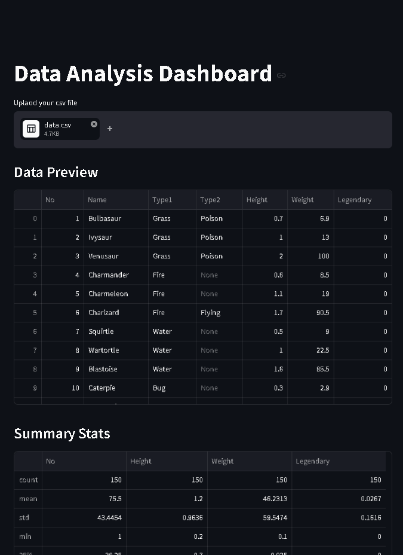
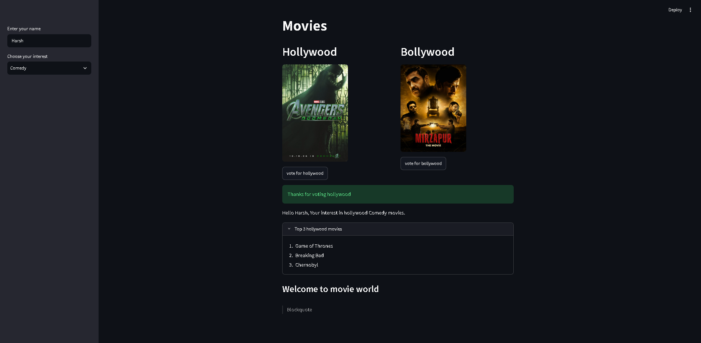

# Streamlit Mini Projects

A collection of interactive mini projects built using **Streamlit**.

## 📊 Data Analysis Streamlit

A Streamlit-based data analysis application created as a demo version of my **1ClickStat** project. It allows users to upload and explore datasets through an interactive dashboard.

This project is currently a preview/demo, and the final version of **1ClickStat** will be developed further.



### How to Run

```bash
cd src/data-analysis-streamlit
uvx streamlit run main.py
```

## 🎬 Movie Interest App

A simple Streamlit application that lets users explore and interact with movie-related data and interests.



### How to Run

```bash
cd src/movie-interest-app
uvx streamlit run main.py
```

## 📄 PDF Downloader UI

A simple Streamlit interface designed for downloading PDFs through a clean and easy-to-use UI.


### How to Run

```bash
cd src/pdf_downloader_ui
uvx streamlit run main.py
```

## 🎂 Age Calculator

A simple Streamlit application that calculates your age based on your selected birthdate.


### How to Run

```bash
cd src/age-calculator
uvx streamlit run main.py
```

---

More Streamlit projects will be added as I continue learning and building.
