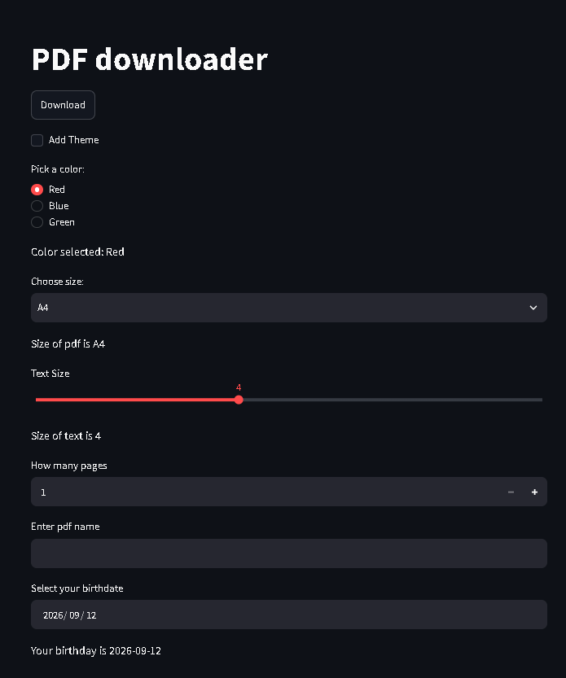
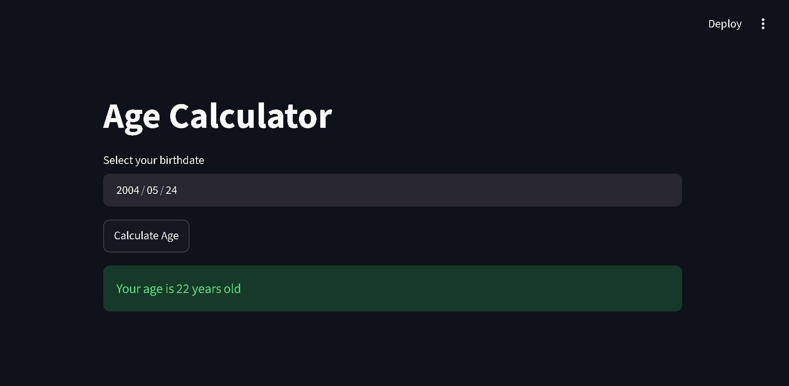

# Streamlit Mini Projects

A collection of interactive mini projects built using **Streamlit**.

## 📄 PDF Downloader UI

A simple Streamlit interface designed for downloading PDFs through a clean and easy-to-use UI.



### How to Run

```bash
cd src/pdf_downloader_ui
uvx streamlit run main.py
```

## 🎂 Age Calculator

A simple Streamlit application that calculates your age based on your selected birthdate.



### How to Run

```bash
cd src/age-calculator
uvx streamlit run main.py
```

---

More Streamlit projects will be added as I continue learning and building.
