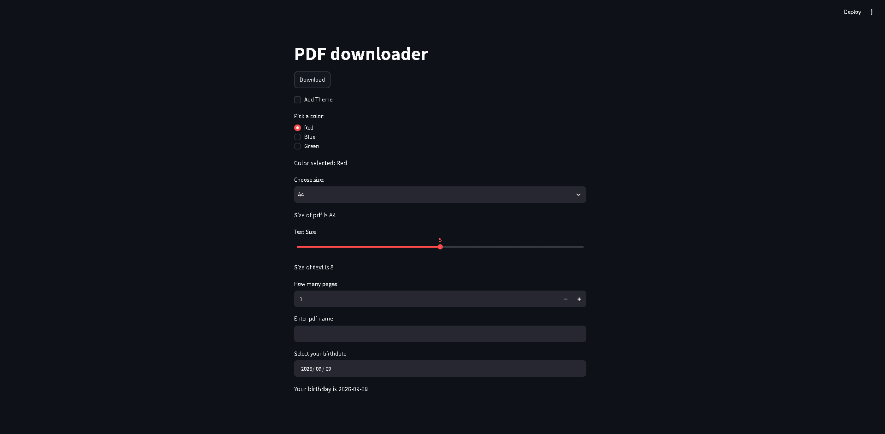

# Streamlit Mini Projects

A collection of interactive mini projects built using **Streamlit** while exploring Python-based web applications and data interfaces.

## Projects

* Age Calculator
* Dashboards
* PDF Downloader UI
* More projects coming soon

## Tech Stack

* Python
* Streamlit
* uv

---

More projects and experiments will be added as I continue learning and building with Streamlit.
